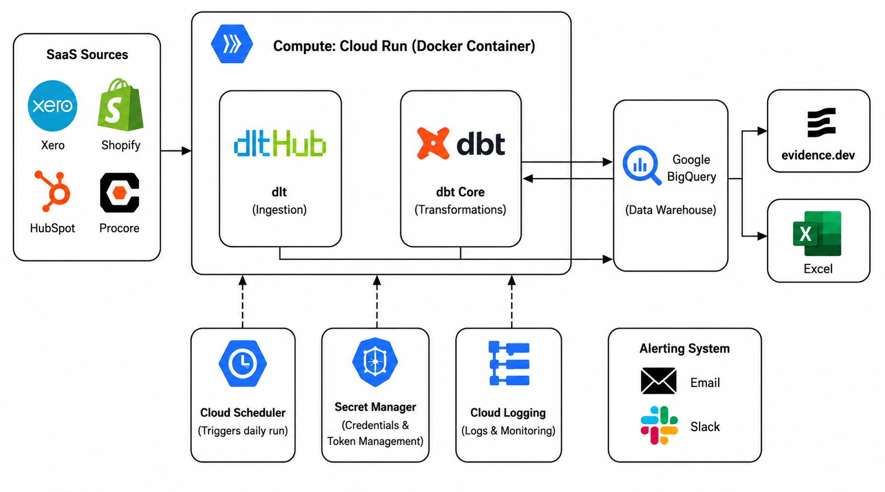

# Multi-Source SaaS Serverless ELT Pipeline: BigQuery, dlt, & dbt Core

A production-ready, parallel ingestion and transformation pipeline for HubSpot, Xero, Shopify, and Procore data using dlt and dbt Core.



### Built for Agencies (BI Analytics, CRM or Marketing)

A cost-effective serverless ELT/ETL solution using dlt and dbt Core to centralize data from HubSpot, Xero, Shopify, and Procore into Google BigQuery or PostgreSQL, eliminating expensive monthly third-party connector fees.

*This system runs automated, low-maintenance pipelines with built-in Slack and Email alerting. Need this deployed, customized, or connected to other APIs? [Let's discuss your project on Upwork](https://www.upwork.com/freelancers/~01ff16ed25bc2d9375).*


### Core Capabilities
* **Saves on Software Fees**: Uses the open-source `dlt` engine to ingest client data, eliminating expensive third-party connector subscriptions.
* **Low-Maintenance Automation**: Scheduled pipeline runs automatically monitor status and report ingestion/dbt metrics via Email and Slack.
* **Highly Customizable**: Easily toggle active sources, add custom API connectors, and configure custom dbt transformation models based on each client's specific business needs.
* **Parallel ELT Ingestion**: Concurrently loads data from HubSpot, Xero, Shopify, and Procore via `dlt` with schema evolution support.
* **OAuth Token Self-Rotation**: Automatically refreshes and persists Xero and Procore OAuth tokens to local secrets or GCP Secret Manager.
* **Preflight Connection Resilience**: Validates credentials before running, gracefully skipping failing sources to keep other ingestions online.
* **In-Database SQL Transformations**: Orchestrates post-load `dbt Core` builds to clean raw data and populate downstream reporting marts.
* **Slack & Email Observability**: Extracts ingestion metrics and dbt results to send Slack summaries and critical failure alerts.
* **GCP Serverless Architecture**: Packaged as a Docker container executed on Cloud Run Jobs, triggered daily by Cloud Scheduler, and targeted to BigQuery.

## Project Structure

```text
.
├── .dlt/
│   ├── config.toml      # Master Control Panel (environments, resources, toggles)
│   └── secrets.toml     # Sensitive credentials (API keys, rotated tokens)
├── dbt_transform/       # dbt models for SQL staging, intermediate, and marts layers
├── docs/                # Developer manual and notes
├── runners/             # Python execution scripts
│   └── run_all.py       # Orchestrates all active pipelines in parallel
├── scripts/             # Utility scripts for local running and GCP deployments
├── sources/             # API extraction logic
└── utils/               # Core pipeline helpers
```

## Execution

### 1. Setup

**Initialize the Environment**:
```bash
python3 -m venv .venv
source .venv/bin/activate
pip install poetry
poetry install
cp .dlt/secrets.toml.example .dlt/secrets.toml
```

### 2. Local Development (PostgreSQL)

To run the pipeline and build your dbt models locally against a local Postgres database:

```bash
bash scripts/run_dev.sh
```
*Note: This script automatically sets `PIPELINE__DESTINATION="postgres"` and runs both the DLT pipeline ingestion and the dbt transformations/tests.*

### 3. Production Deployment (GCP Cloud Run & BigQuery)

Production runs execute on GCP Cloud Run Jobs and write directly to BigQuery. There is **no need** to manually edit `.dlt/config.toml` before deploying; the GCP environment is configured to override the destination to `bigquery` automatically.

GCP Services Used:
* Cloud Run Jobs: Runs the pipeline execution container.
* BigQuery: Stores raw loaded tables and dbt transformed reporting tables.
* Secret Manager: Stores credentials and rotated OAuth tokens in secrets.toml.
* Cloud Scheduler: Triggers the daily execution run.
* Artifact Registry: Stores built Docker container images.
* Cloud Build: Compiles and pushes container images from the repository.

To deploy code updates to production:
```bash
bash scripts/rebuild_and_deploy.sh
```

To run/test the production pipeline manually:
```bash
bash scripts/run_prod.sh
```

---

## Source Authorization Setup

Each source requires a one-time setup to authorize the connection.

### HubSpot
* Create a Private App in HubSpot and copy the Access Token.
* Add to `[sources.hubspot]` in `.dlt/secrets.toml`.

### Xero
* Create an app at developers.xero.com.
* Set the Redirect URI to `http://localhost:8080/callback`.
* Run `poetry run python sources/xero/auth.py` once to perform the OAuth handshake.
* The pipeline handles token rotation automatically thereafter.

### Procore
* Create an app at developers.procore.com.
* Set the Redirect URI to `http://localhost:8080/callback`.
* Install the app in your Procore Company Admin under App Management.
* Run `poetry run python sources/procore/auth.py` once.
* Tokens are persisted and rotated automatically in `.dlt/secrets.toml`.
