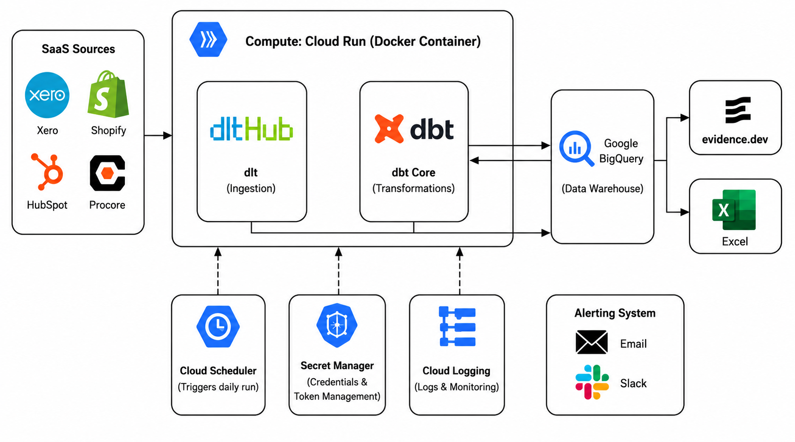

# Multi-Source SaaS Serverless ELT Pipeline & BI Dashboard

An end-to-end, code-first data pipeline integrating **HubSpot**, **Xero**, **Shopify**, and **Procore** into **Google BigQuery** (Cloud) and **PostgreSQL** (Local), powered by `dlt`, `dbt Core`, and `Evidence.dev`.



---

## 🚀 Overview

A code-first serverless ELT pipeline that centralizes data from SaaS APIs into **Google BigQuery** (Production) or **PostgreSQL** (Local Development) using open-source tooling.

### Core Capabilities
* **API Retry & Rate Limit Handling**: Catches HTTP 429 rate limits, parses `Retry-After` headers, and retries transient network or 5xx server drops with exponential backoff using `tenacity`.
* **Preflight Connection Resilience**: Verifies credentials and checks OAuth refresh tokens prior to execution; prompts for interactive re-authorization locally or isolates and skips failing sources so remaining ingestions continue.
* **Schema Evolution**: Powered by `dlt` to detect upstream schema modifications, infer data types, and apply table migrations automatically in the destination warehouse.
* **Merge Write Dispositions**: Uses primary-key merge dispositions (`write_disposition="merge"`) across CRM and ERP endpoints to upsert records and avoid duplicates during re-runs.
* **In-Warehouse Transformations**: Orchestrates post-load `dbt Core` builds to clean, union, and model raw source data into reporting marts without modifying raw data.
* **Metric-to-Source Lineage**: Modular staging-to-intermediate-to-mart DAG structure tracing dashboard figures back to source entity IDs (`invoice_id`, `deal_id`, `project_id`).
* **Execution Observability**: Sends Slack notifications summarizing `dlt` ingestion row counts and `dbt test` execution outcomes after each pipeline run.
* **Serverless Execution & Headless OAuth**: Runs as a containerized job on GCP Cloud Run Jobs, automatically refreshing and persisting rotating OAuth 2.0 tokens (Xero, Procore) to a GCS Token Vault.

---

## 📁 Repository Structure

```text
.
├── .dlt/
│   ├── config.toml      # Master Control Panel (pipeline toggles, active resources)
│   └── secrets.toml     # Sensitive credentials & OAuth tokens (git-ignored)
├── dbt_transform/       # dbt transformation models & automated tests
│   └── models/
│       ├── staging/      # Raw source cleaning & typecasting (hubspot, xero, shopify, procore)
│       ├── intermediate/ # Cross-source deduplication & unified revenue streams
│       └── marts/        # Analytical facts & dimensions for BI reporting
├── evidence_dashboard/  # Evidence.dev BI dashboard (pages, components, queries)
├── runners/             # Python execution orchestrators (parallel run_all.py)
├── scripts/             # Unified CLI (pipeline.sh) & OAuth helper scripts
├── sources/             # dlt source extractors (HubSpot, Xero, Shopify, Procore)
├── utils/               # Secret manager, logger, retry handler, Slack notifier
├── Dockerfile           # Production container specification for GCP Cloud Run
└── README.md            # Master repository documentation
```

---

## 🛠️ Quick Start & Usage

### 1. Environment Setup

```bash
python3 -m venv .venv
source .venv/bin/activate
pip install poetry
poetry install
cp .dlt/secrets.toml.example .dlt/secrets.toml
```

### 2. Unified Pipeline CLI (`scripts/pipeline.sh`)

All local and cloud operations are managed through the single `scripts/pipeline.sh` CLI:

```bash
# Full Local Pipeline (Extract APIs -> Local Postgres -> Run & Test dbt)
bash scripts/pipeline.sh dev

# Fast dbt Model Iteration (No slow API extraction, runs dbt in ~2s)
bash scripts/pipeline.sh dbt dev                            # All models against Local Postgres
bash scripts/pipeline.sh dbt dev --select fct_executive_cockpit  # Specific model
bash scripts/pipeline.sh dbt prod                           # Validate directly against BigQuery

# Launch Evidence Dashboard
bash scripts/pipeline.sh dashboard dev                      # Connected to Local Postgres
bash scripts/pipeline.sh dashboard prod                     # Connected to BigQuery

# Production Cloud Management (GCP)
bash scripts/pipeline.sh auth                               # Interactive OAuth re-authorization & GCS sync
bash scripts/pipeline.sh deploy                             # Build Docker image & update Cloud Run Job
bash scripts/pipeline.sh prod                               # Trigger Cloud Run Job execution on GCP
```

---

## 📊 Data Transformation Layer (`dbt Core`)

Raw schemas extracted by `dlt` are transformed inside your data warehouse following dbt best practices:

```text
dlt (Extract + Load)
  └── Raw Schemas (hubspot, xero, shopify, procore)
        └── Staging Views (stg_*)      → Clean column names, cast types
              └── Intermediate Views (int_*) → Deduplicate, union sources
                    └── Mart Tables (fct_*, dim_*) → Analytical reporting tables
```

### Marts & Dimension Model Inventory

| Layer | Model | Description |
| :--- | :--- | :--- |
| **Staging** | `stg_hubspot__contacts` | HubSpot contacts & properties |
| **Staging** | `stg_hubspot__companies` | HubSpot company records & lifecycle stages |
| **Staging** | `stg_hubspot__deals` | HubSpot pipeline deals & monetary amounts |
| **Staging** | `stg_procore__projects` | Procore project directory |
| **Staging** | `stg_procore__companies` | Procore corporate accounts |
| **Staging** | `stg_procore__users` | Procore user directory |
| **Staging** | `stg_shopify__products` | Shopify product catalog |
| **Staging** | `stg_shopify__variants` | Shopify product variants & inventory pricing |
| **Staging** | `stg_xero__invoices` | Xero financial invoices & billing status |
| **Staging** | `stg_xero__line_items` | Xero invoice line items |
| **Staging** | `stg_xero__contacts` | Xero billing contacts |
| **Intermediate** | `int_all_revenue` | Unified revenue stream (HubSpot deals + Xero invoices) |
| **Intermediate** | `int_contacts_deduped` | Master golden contact record across CRM & ERP |
| **Marts** | `fct_executive_cockpit` | Consolidated executive cockpit mart for BI dashboard |
| **Marts** | `fct_pipeline` | CRM deal pipeline metrics with portable ANSI typecasting |
| **Marts** | `fct_revenue` | Fact revenue table with calendar period granularity |
| **Marts** | `dim_customers` | Customer dimension with surrogate key hashing |
| **Marts** | `dim_products` | Product dimension across Shopify catalog |
| **Marts** | `dim_projects` | Project dimension across Procore accounts |

---

## 📈 BI Dashboard (`Evidence.dev`)

The BI dashboard is built with Evidence.dev and deployed automatically to GitHub Pages.

> [!NOTE]
> The demo dashboard does use simulated scenario data modeled after real-world SaaS business transactions.

**Environment Authentication**: Evidence authenticates via environment variables (`PGPASSWORD` for Postgres, Application Default Credentials for BigQuery).
* **Production CI/CD**:
  * Push to `dev` branch → Deploys preview dashboard to GitHub Pages (`/dev/overview`).
  * Merge to `main` branch → Deploys production dashboard to GitHub Pages (`/overview`).

---

## 🔑 Source API Authorization Setup

Each source requires initial configuration in `.dlt/secrets.toml`:

### HubSpot
1. Create a Private App in HubSpot and copy the Access Token.
2. Set `api_key` under `[sources.hubspot]` in `.dlt/secrets.toml`.

### Xero
1. Register an application at [developers.xero.com](https://developers.xero.com).
2. Set Redirect URI to `http://localhost:8080/callback`.
3. Run `bash scripts/pipeline.sh auth` (select Xero) once to authorize. Token rotation is fully automatic thereafter.

### Procore
1. Register an application at [developers.procore.com](https://developers.procore.com).
2. Set Redirect URI to `http://localhost:8080/callback`.
3. Install the app in Procore Company Admin.
4. Run `bash scripts/pipeline.sh auth` (select Procore) once to complete OAuth handshake.

### Shopify
1. Create a Custom App in Shopify Admin under App Development.
2. Copy Admin API Access Token and Store URL into `[sources.shopify]` in `.dlt/secrets.toml`.

---

## 📌 Roadmap & Known Gaps

- [ ] **Terraform**: Provision Cloud Run, Scheduler, and GCS with Terraform instead of manual `gcloud` CLI commands.
- [ ] **Pipeline CI/CD**: Automate Docker image build and deployment to Cloud Run on git push (currently deployed via CLI).
- [ ] **Python Orchestrator**: Replace the bash runner (`pipeline.sh`) with a Python runner for cleaner error handling and alerts.
